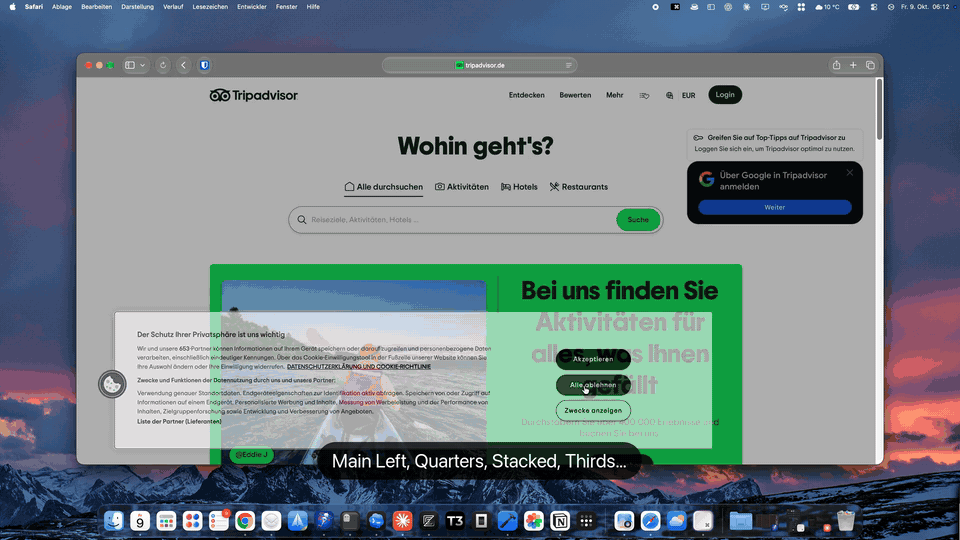
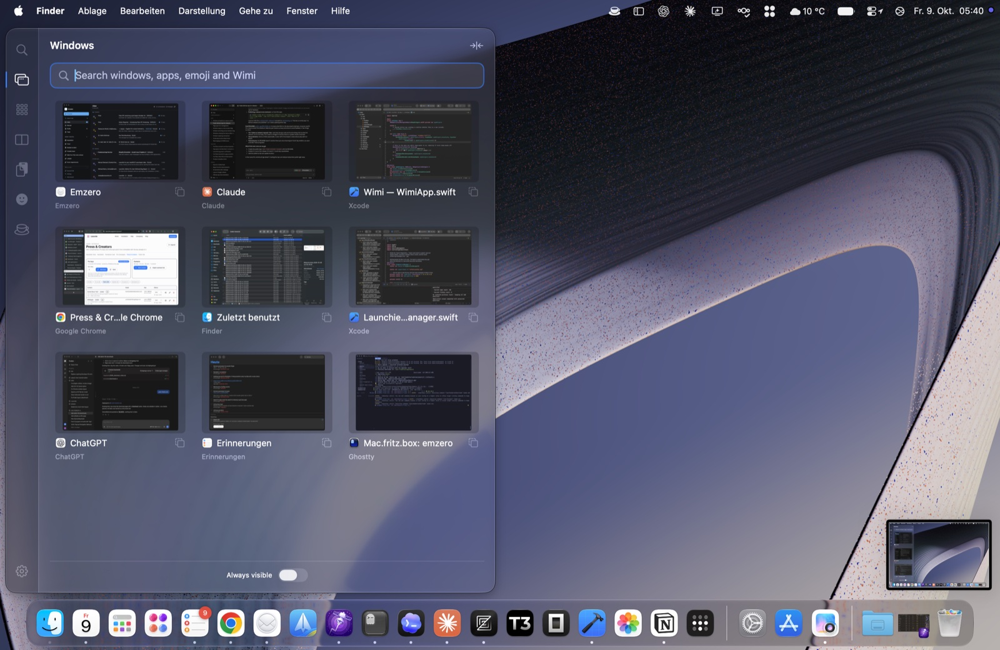
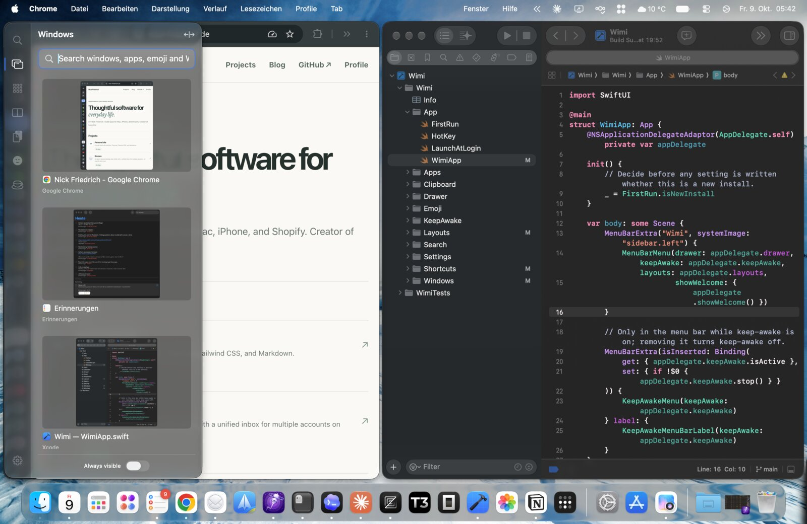
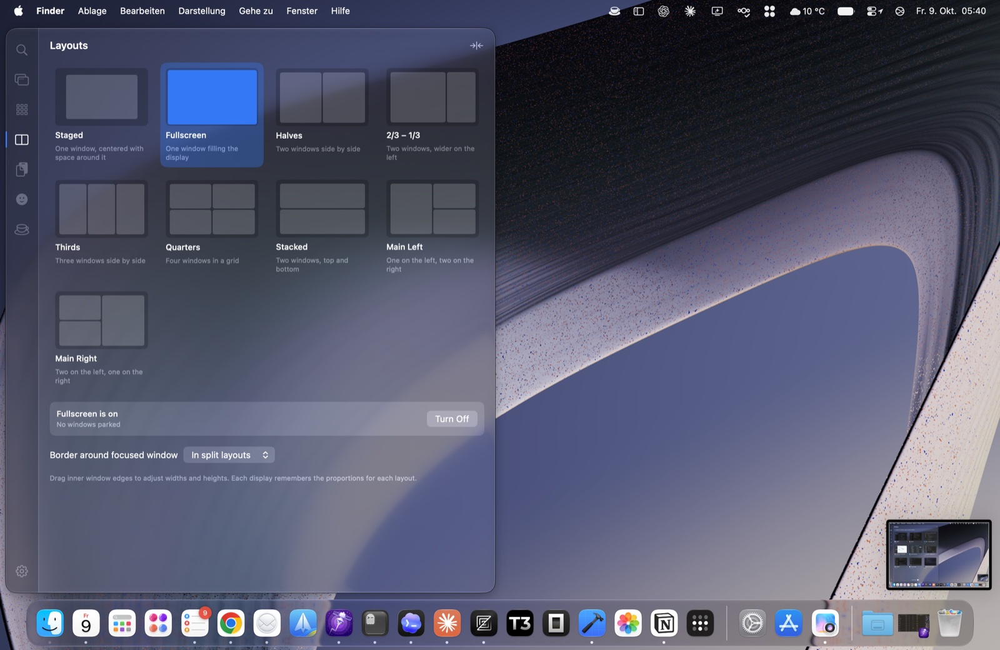
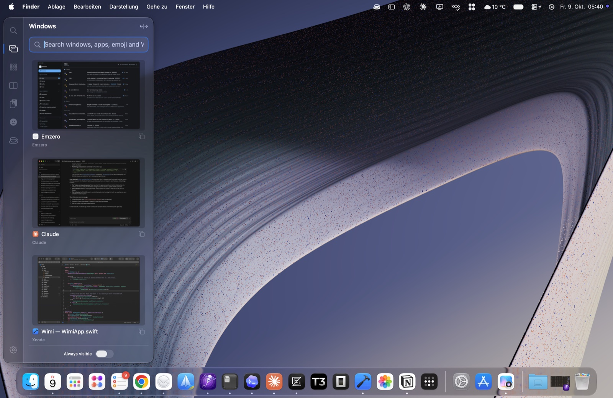
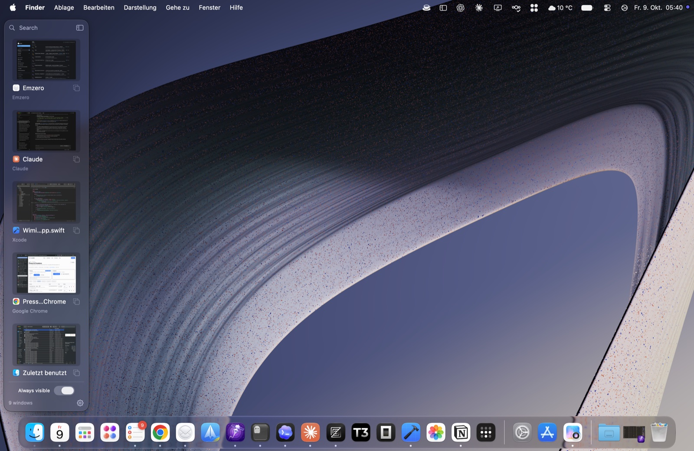

# Wimi — Window Manager Improved

A macOS menu bar app that puts window switching, window layouts, an app launcher, search, emoji and an optional clipboard history in one drawer that slides in from the edge of the screen.

> Wimi is closed source. This repository is used only for **downloads, release notes and feedback**.



▶️ **[Watch the full 45-second demo](media/wimi-demo.mp4)**





| Layouts | Compact drawer | Always-visible strip |
|---|---|---|
|  |  |  |

## Download

Get the latest `.dmg` from **[Releases](../../releases/latest)**, open it, and drag Wimi into Applications.

- Requires macOS 14 Sonoma or later
- Universal build (Apple silicon and Intel)
- Signed with a Developer ID and **notarized by Apple**, so Gatekeeper opens it without any workarounds

### Verify the download (optional)

Every release lists the SHA-256 checksum of its DMG. To check yours:

```sh
shasum -a 256 ~/Downloads/Wimi-*.dmg
```

## Features

- **Drawer:** slides in when the mouse rests at the left or right screen edge, or opens with a shortcut. Works on multiple displays.
- **Window switcher:** every open window with live previews. Hold ⌥Tab to switch, with search and keyboard navigation.
- **Window layouts:** halves, thirds, quarters, 2/3–1/3, stacked and main+side layouts for each display. Drag a window onto a slot to place it.
- **Global search:** one search across windows, apps, layouts and actions. Start typing anywhere in the drawer.
- **App launcher:** an icon grid with search that learns which apps you open most.
- **Emoji picker:** search, recents, and insertion into the current app.
- **Clipboard history:** optional and off by default.
- **Keep Awake:** stop the Mac from sleeping for a set time.
- **Hyper key:** optionally turns Caps Lock into ⌃⌥⌘ for your own shortcuts.

## Permissions

- **Accessibility:** required to list, focus and move windows.
- **Screen Recording:** optional, used only for live window previews.

## Privacy

Wimi makes no network requests. Window history and clipboard data stay on your Mac.

## Feedback

Found a bug or have an idea? [Open an issue](../../issues).

## Uninstall

Quit Wimi from the menu bar and move it from Applications to the Trash.
